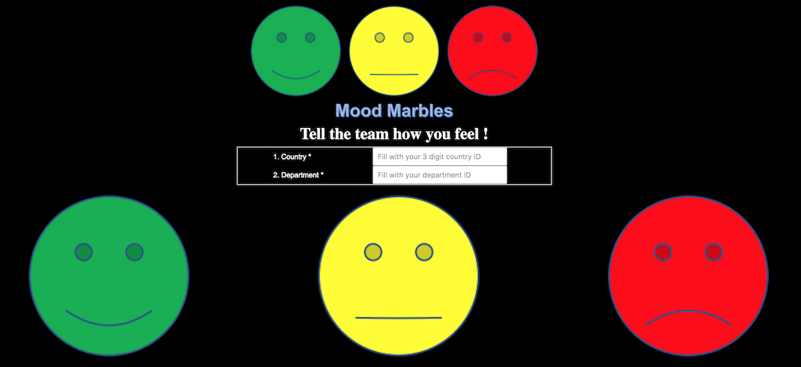
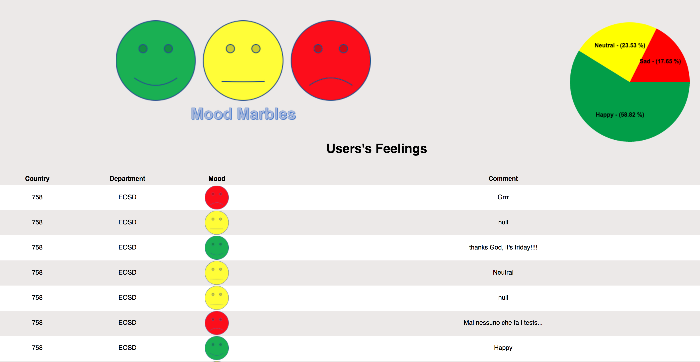
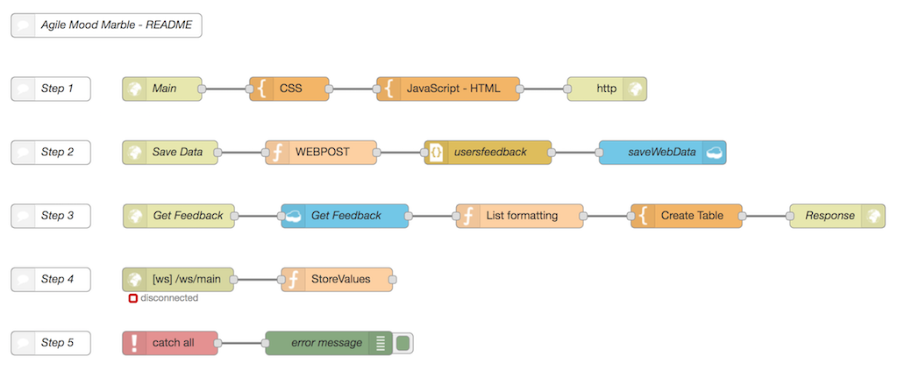

Mood Marble Agile tool
====================================

### Italy EOSD Mood Marble tool
This application is intended to support the the Mood MArble Agile practice. This is the instance
that supports the web side of the application. The mobile version (available for iOS devices) could be reached at the following address: `https://github.com/marcodago/AgileMoodMarbles`.

This app has been developed using the `Node-Red starter` boilerplate.  

### How does this work?
When you open the webpage, you are requested to identify yourself filling the information related to the country & department. These info are necessary to categorize evaluations under the right organization, given that CloudantDB where data are stored is unique. After that, simply press the smiley that better fit with your feeling. A possibility to leave a comment is also included.

The defaulted webpage address name is set within Node-Red node (here it is called `root/Main`) 

When you press the submit button, score is then registered, as a record, in Cloudant DB and a "Visualize Feedback" button appears on the webpage. Clicking on it you'll be redirected to the webpage showing the evaluations list and the RAG values, filtered by Country & Dept previously declared.

### Customising Node-RED
This repository is here to be cloned, modified and re-used to allow anyone create
their own Node-RED based application that can be quickly deployed to Bluemix.

The Node-Red flows are stored in the `defaults` directory in the file called `flow.json`.
When the application is first started, this flow is copied to the attached Cloudant
instance. Otherwise, you could copy the entire flow and paste it into Node-Red, using the import capability.

The image content is stored under the `public/images` directory.

If you do clone this repository, make sure you update this `README.md` file to point
the `Deploy to Bluemix` button at your repository.

Marco D.
